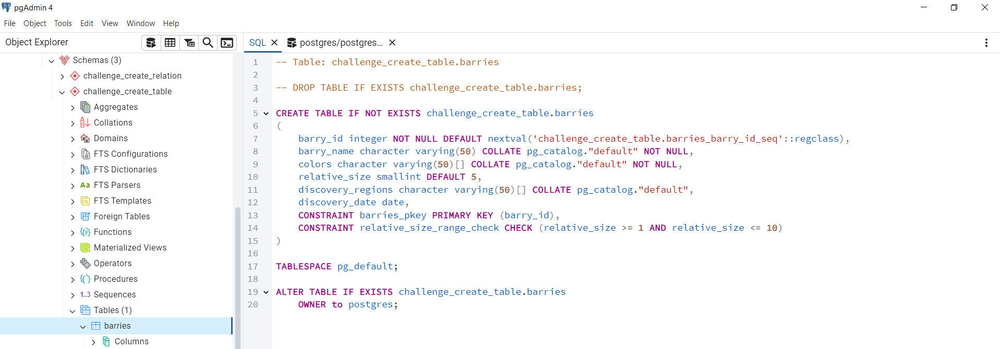

# PostgreSQL Demo

Implemented based on LinkedIn learning course:
[PostgreSQL Essential Training](https://www.linkedin.com/learning/postgresql-essential-training-22611610)

**Content**:

  * [Prepare](#prepare)
  * [Theory](#theory)
  * [Practice](#practice)
    * [Challenge: Create Table](#challenge-create-table)
    * [Challenge: Create Relation](#challenge-create-relation)

## Prepare

- Install PostgreSQL Server on your machine which is actual RDBMS
- Install pgAdmin desktop app which is client for working with PostgreSQL Server
- Install PSQL tool which is alternative client for working with PostgreSQL Server

In this demo we will use pgAdmin app.

## Theory

PostgreSQL's data structure at top level looks like this:


- Top elements are server groups which are used 
  to separate different PostgreSQL Servers
  running in different data centers, e.g. `local`, `AWS`, `On-premises` 
  or in different environments like `dev`, `test`, `prod`.
- Next we see `PostgreSQL 17` as the specific Server running on our local
- Inside PostgreSQL Server we can have multiple databases 
  which is secure logical separation of resources. 
  This way we can have different databases for different purposes, e.g. `dev`, `test`, `prod`
  without having multiple physical Servers.
  In our case we have `metadata` and `postgres` databases

Inside database, we have next structure:


- Schemas are used to group different tables by domain, 
  like schemas `assests`, `people`, `public` in our case.
- Finally, inside schema, we have tables with columns


## Practice

### Challenge: Create Table

**Task:** 
- Create table to store different kinds of Barry 
- Have columns for `id`, `name`, `color` and any others to use different data types 
- Check created table and its properties
- Populate table with data
- Check all rows of the table

**Solution:**

- Execute query to create new Schema `challenge_create_table` to separate this challenge:
```
CREATE SCHEMA IF NOT EXISTS challenge_create_table
    AUTHORIZATION postgres;
```

- Execute query to create new Table `barries` in `challenge_create_table` Schema: 
```
CREATE TABLE IF NOT EXISTS challenge_create_table.barries
(
    barry_id          serial                   NOT NULL,
    barry_name        character varying(50)    NOT NULL,
    colors character  varying(50)[]            NOT NULL,
    relative_size     smallint                           DEFAULT 5,
    discovery_regions character varying(50)[],
    discovery_date    date,
    PRIMARY KEY (barry_id),
    CONSTRAINT relative_size_range_check CHECK (relative_size BETWEEN 1 AND 10) NOT VALID
);
```

- Check created table using `pgAdmin` app &#8594; `barries` table &#8594; `SQL` tab:



- Execute query to insert data to `barries` table:

```
INSERT 
    INTO challenge_create_table.barries 
        (barry_name,    colors,                         discovery_regions,                discovery_date,     relative_size) 
    VALUES
        ('Blueberry',   ARRAY['blue', 'purple'],        ARRAY['North America', 'Europe'], '1900-01-01'::date,             4),
        ('Strawberry',  ARRAY['red', 'pink'],           ARRAY['Europe', 'North America'], '1300-01-01'::date,             5),
        ('Raspberry',   ARRAY['red', 'black'],          ARRAY['Europe', 'Asia'],          '1500-01-01'::date,             6),
        ('Blackberry',  ARRAY['black', 'dark purple'],  ARRAY['North America', 'Europe'], '1600-01-01'::date,             7),
        ('Cranberry',   ARRAY['red'],                   ARRAY['North America'],           NULL,                           5),  -- NULL for discovery_date
        ('Gooseberry',  ARRAY['green', 'yellow'],       ARRAY['Europe', 'Asia'],          NULL,                           3),  -- NULL for discovery_date
        ('Mulberry',    ARRAY['black', 'white', 'red'], ARRAY['China', 'India'],          NULL,                           6),  -- NULL for discovery_date
        ('Elderberry',  ARRAY['purple', 'black'],       ARRAY['Europe', 'North America'], '1000-01-01'::date,             5),
        ('Huckleberry', ARRAY['blue', 'purple'],        ARRAY['North America'],           '1900-01-01'::date,             4),
        ('Salmonberry', ARRAY['yellow', 'orange'],      ARRAY['Pacific Northwest'],       NULL,                           3);  -- NULL for discovery_date
```

- Check data persistence using `pgAdmin` app &#8594; `barries` table &#8594; `All Rows` button:


### Challenge: Create Relation

**Task:** 
- Create table `departments` with columns `id`, `name`, `building`
- Create table `employees` with columns `id`, `full_name`, `hire_date`, `department_id`
- Create foreign key relation between tables on `department_id`
- Populate tables with data
- Check how relation works when creating `employee` with not existing `department`
- Check how relation works when updating `employee` by setting not existing `department`
- Check how relation works when updating `department` by setting new `id`,
  when some `employee` references this `department` 
- Check how relation works when deleting `department`,
  when some `employee` references this `department`

**Solution:**

- Execute query to create Schema `challenge_create_relation` to separate this challenge:
```
CREATE SCHEMA IF NOT EXISTS challenge_create_relation
    AUTHORIZATION postgres;
```

- Execute query to create Table `departments` in `challenge_create_relation` Schema:
``` 
CREATE TABLE IF NOT EXISTS challenge_create_relation.departments
(
    department_id   serial                  NOT NULL,
    department_name character varying(50)   NOT NULL,
    building        character varying(100),
    PRIMARY KEY (department_id)
);
```

- Execute query to create Table `employees` in `challenge_create_relation` Schema:
```
CREATE TABLE IF NOT EXISTS challenge_create_relation.employees
(
    employee_id         serial       NOT NULL,
    full_name character varying(100) NOT NULL,
    hire_date           date,
    department_id       integer,
    PRIMARY KEY (employee_id),
    FOREIGN KEY (department_id)
        REFERENCES challenge_create_relation.departments (department_id) MATCH SIMPLE
        ON UPDATE RESTRICT
        ON DELETE RESTRICT
        NOT VALID
);
```

- Execute query to insert data to `departments` table:
```
INSERT 
    INTO challenge_create_relation.departments
        (department_name,     building   ) 
    VALUES 
        ('Human Resources',  'Building A'), 
        ('Marketing',        'Building B'), 
        ('Finance',          'Building C'), 
        ('Sales',            'Building D'), 
        ('IT',               'Building E'), 
        ('Legal',            'Building F'), 
        ('Operations',       'Building G'), 
        ('Research',         'Building H'), 
        ('Engineering',      'Building I'), 
        ('Customer Service', 'Building J');
```

- Execute query to insert data to `employees` table:
```
INSERT 
    INTO challenge_create_relation.employees 
        (full_name,       hire_date,    department_id) 
    VALUES
        ('Alice Johnson', '2022-01-15',             1),
        ('Bob Smith',     '2021-03-22',             2),
        ('Charlie Brown', '2020-07-18',             3),
        ('Dana White',    '2019-11-08',             4),
        ('Eli Black',     '2018-09-14',             5),
        ('Fiona Green',   '2017-05-23',             6),
        ('George Blue',   '2016-12-30',             7),
        ('Hannah Grey',   '2015-04-05',             8),
        ('Ivy Purple',    '2014-10-19',             9),
        ('Jack Red',      '2013-08-25',            10);
```

- Execute query to check that foreign key protects `employees` table
  from creating `employee` with not existing `department`:

```
INSERT 
    INTO challenge_create_relation.employees (full_name, hire_date, department_id)
    VALUES ('Alice Johnson', '2022-01-15', 11);
```
```
----- Messages ---------------------------------------------------------------------------------------------
ERROR:  Insert or update in table "employees" violates foreign key constraint "employees_department_id_fkey"
SQL state: 23503
Detail: Key (department_id)=(11) does not exist in table "departments".
------------------------------------------------------------------------------------------------------------
```

- Execute query to check that foreign key protects `employees` table
  from setting `employee.department_id` to not existing `department`:

```
UPDATE challenge_create_relation.employees 
SET department_id = 11 
WHERE employee_id = 1;
```
```
----- Messages ---------------------------------------------------------------------------------------------
ERROR:  Insert or update in table "employees" violates foreign key constraint "employees_department_id_fkey"
SQL state: 23503
Detail: Key (department_id)=(11) does not exist in table "departments".
------------------------------------------------------------------------------------------------------------
```

- Execute query to check that foreign key protects `departments` table
  from changing `department_id` when some `employee` refers this `department`:
```
UPDATE challenge_create_relation.departments
SET department_id = 11
WHERE department_id = 1;
```
```
----- Messages ---------------------------------------------------------------------------------------------
ERROR:  Update or delete in table "departments" violates foreign key constraint "employees_department_id_fkey" in table "employees"
SQL state: 23503
Detail: Key (department_id)=(1) is still referenced in the table "employees".
------------------------------------------------------------------------------------------------------------
```

- Execute query to check that foreign key protects `departments` table
  from deleting `department` when some `employee` refers it:
```
DELETE FROM challenge_create_relation.departments
WHERE department_id = 1;
```
```
----- Messages ---------------------------------------------------------------------------------------------
ERROR:  Update or delete in table "departments" violates foreign key constraint "employees_department_id_fkey" in table "employees"
SQL state: 23503
Detail: Key (department_id)=(1) is still referenced in the table "employees".
------------------------------------------------------------------------------------------------------------
```

